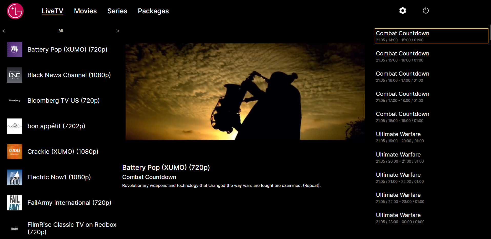

<h1 align="center">Crocott</h1>
<h2 align="center">Разработка TV-плеера на React с нуля для LG.</h2>

    

## Cсылки:

Макет: 

## Установка и запуск приложения в локальном репозитории, эксплуатация
1. `git clone https://github.com/AleksLomako/crocott.git` - клонировать репозиторий на свое устройство (HTTPS)
2. `npm i` - установить зависимости
3. `npm run start` - запустить приложение

## Стэк технологий

  
  
  
  
  

## Реализованный функционал:
- Настроена инфраструктура и необходимые роуты
- Авторизация пользователя
- Реализованы асинхронные GET- и POST-запросы к API
- Компонент Live TV : Player, Channels, Programs

## Разрабатываемый функционал:
- Компоненты Movies, Series, Settings
- Фильтр по фильмам, сериалам